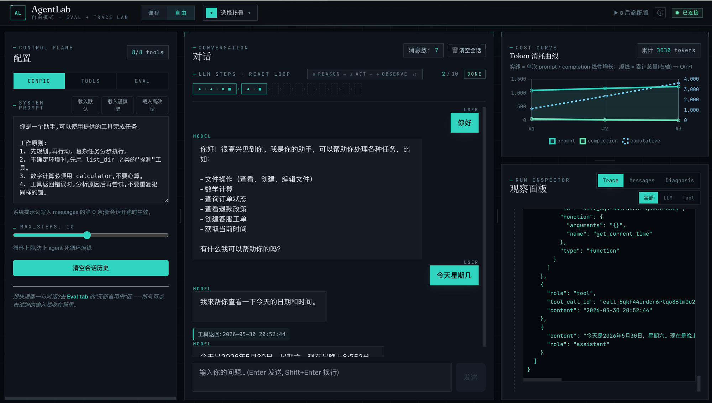

# AgentLab

> Copyright © 2026 Calvin-teclab · 基于 [PolyForm Noncommercial 1.0.0](LICENSE) 授权（**仅限非商业用途**）

> 我自己用来折腾 Agent 底层逻辑的实验项目：通过前端配置和点击，直观地看到 Agent 每一步的决策、工具调用、消息流转与 token 消耗，方便我快速验证 prompt、工具描述和参数 schema 对模型行为的影响。



## 功能特性

- ✅ **实时时间轴**：Agent 每一步 LLM 决策、工具调用、工具结果以卡片形式展开，可点开看完整 JSON
- ✅ **messages 列表可视化**：动态展示 Agent 的"记忆"如何线性增长
- ✅ **Token 消耗曲线**：实时绘制 `prompt_tokens` 变化，直观感受成本的二次方规律
- ✅ **工具勾选**：前端复选框启用 / 禁用内置工具（时间 / 计算器 / 读文件 / 写文件 / 列目录）
- ✅ **引导关卡**：内置 6 关 agent 第一性原理课（记忆是假象 → 工具 → 规划 → 工具描述 → system prompt → 长期记忆），关卡锁定 / 预设配置，自评式推进
- ✅ **长期记忆（跨会话）**：与"工具"平级的独立子系统，演示 `Agent = LLM + 工具 + 记忆` 的真相——写 = 模型调一次 `remember` 工具，读 = 新会话开头注入一条 `system` 消息；后端对记忆完全无状态（持久化在前端 localStorage），「清空会话 ≠ 清空记忆」
- ✅ **工具实验室**：前端可新增、编辑、复制 mock 工具，观察工具命名、description、参数 schema 如何影响模型调用
- ✅ **人工工具返回**：模型发起工具调用后可暂停，由用户手动填写 / 修改工具返回，再观察模型如何继续推理
- ✅ **System Prompt 编辑器**：实时编辑，**新会话开跑时生效**（如已有 messages 历史，需 🗑 清空会话才会换 prompt — 这是 agent 工程的真实语义：prompt 是 messages[0]，不会中途换）
- ✅ **SSE 流式推送**：每一步事件第一时间推到前端，不用等 Agent 跑完
- ✅ **Eval Suite**：内置 benchmark case，对照预期工具链，观察成功率、成本、步数和失败模式
- ✅ **Mass 场景模板**：一键切换电商客服 Agent，展示订单查询、退款政策和人工接管等业务流程
- ✅ **失败归因面板**：自动识别应调未调、误调工具、参数错误、工具返回异常、预算失控和安全边界触发

## 技术栈

- **后端**：FastAPI + SSE 流式推送
- **前端**：单 HTML + Tailwind CDN + Alpine.js + Chart.js（零构建、零 npm）
- **LLM**：OpenAI 兼容协议，已接入火山方舟（DeepSeek 等）和 Google Gemini，换其它模型只需改环境变量

## 快速开始

### 一键启动

配置好后端环境变量后,下次可以直接在项目根目录运行:

```bash
./start.sh
```

脚本会同时启动:

- 后端: `http://127.0.0.1:8000`
- 前端: 默认从 `http://127.0.0.1:5173` 开始找可用端口

如果后端不是默认 8000 端口,前端也支持直接在 URL 里指定:

```text
http://127.0.0.1:5180/?backend=http://127.0.0.1:8010
```

按 `Ctrl+C` 会同时停止两个服务。

### 1. 安装依赖

```bash
cd backend
pip install -r requirements.txt
```

### 2. 配置环境变量

```bash
cp .env.example .env
# 编辑 .env,填入你的 API key 和 model endpoint（ARK_* 或 GEMINI_*，至少配一组）
```

### 3. 启动后端

```bash
cd backend
uvicorn main:app --reload --port 8000
```

### 4. 打开前端

直接在浏览器打开 `frontend/index.html` 即可（无需构建）。

或用任意静态服务器：

```bash
cd frontend
python3 -m http.server 5173
# 访问 http://localhost:5173
```

## 目录结构

```
AgentLab/
├── backend/
│   ├── main.py              # FastAPI 入口 + SSE 路由
│   ├── agent.py             # Agent 核心循环
│   ├── tools.py             # 内置工具实现
│   ├── schemas.py           # Pydantic 模型
│   ├── evals.py             # benchmark / 场景模板 / 失败分类
│   ├── lessons.py           # 内置引导关卡配置
│   ├── requirements.txt
│   ├── .env.example
│   └── workspace/           # 沙箱目录(gitignore)
├── frontend/
│   └── index.html           # 单页应用
├── .gitignore
└── README.md
```

## 使用说明

1. 启动后端和前端后，打开浏览器
2. 左侧配置面板：
   - 勾选要启用的工具
   - 在「工具实验室」新增 / 编辑 mock 工具，调整 name、description、parameters JSON schema 和返回模板
   - 开启「人工接管工具返回」后，可在每次工具调用时手动填写 observation
   - 编辑 system prompt
   - 调整 MAX_STEPS
3. 中栏输入问题（例如"算一下 workspace/scores.txt 里所有人的平均分"）
4. 右栏实时看每一步 Agent 内部的活动：
   - LLM 想调什么工具
   - 工具返回了什么
   - messages 列表怎么变
   - token 消耗怎么涨
   - 本轮是否命中 benchmark 预期、失败应该归到哪类问题

### 自定义工具实验

「工具实验室」里的内置工具会真实执行，例如读写 `backend/workspace` 文件。自己新增的工具是 mock 工具：

- `name`、`description`、`parameters` 会真实进入 LLM 的 `tools` schema，影响模型是否选择调用它
- `response_template` 由后端执行时返回，可使用 `{{tool_name}}`、`{{args_json}}` 和 `{{arg.字段名}}`
- 调用过程仍会出现在右侧时间轴和中间 messages 列表里，方便比较不同工具描述和参数结构带来的差异

常用实验方式：

1. 复制一个内置工具，改成更宽泛或更具体的 description
2. 新增两个功能相近但描述边界不同的 mock 工具
3. 用同一句用户问题多跑几次，观察模型选择哪个工具、生成了什么参数

### 人工修改工具返回

开启「人工接管工具返回」后，Agent 的执行会在模型发起 tool call 后暂停：

1. 前端展示模型选择的工具名和生成的参数
2. 你手动填写或修改工具返回内容
3. 前端把这段文本作为 `role=tool` 的消息写入 messages
4. 后端继续请求模型，观察模型如何基于这个人工 observation 改变回答

适合用来验证：

- 工具返回错误、空结果或异常格式时，模型是否能纠正
- 同一个 tool call 参数下，不同 observation 会让模型生成什么不同结论
- 多工具场景里，每一步 observation 如何影响后续规划

## 示例任务

几个可以快速上手的测试任务：

| 任务 | 预期步数 | 目的 |
|---|---|---|
| `现在几点？` | 2 步 | 单工具调用 |
| `workspace 里有什么？` | 2 步 | 探索型工具 |
| `算一下 scores.txt 所有人的平均分` | 4 步 | 多工具串联规划 |
| `读一下 /etc/passwd` | 1 步 | 安全沙箱拦截 |

## License

Copyright © 2026 Calvin-teclab.

本项目基于 **[PolyForm Noncommercial License 1.0.0](LICENSE)** 授权：

- ✅ 允许任何**非商业**用途：个人学习、研究、实验、教育、非营利组织使用
- ✅ 允许修改、分发、二次创作 —— 但必须保留版权署名（`Required Notice`）
- ❌ **禁止任何商业用途**（含商用产品、付费服务、商业培训等）

如需商业授权，请通过 GitHub 联系作者 [@Calvin-teclab](https://github.com/Calvin-teclab)。
